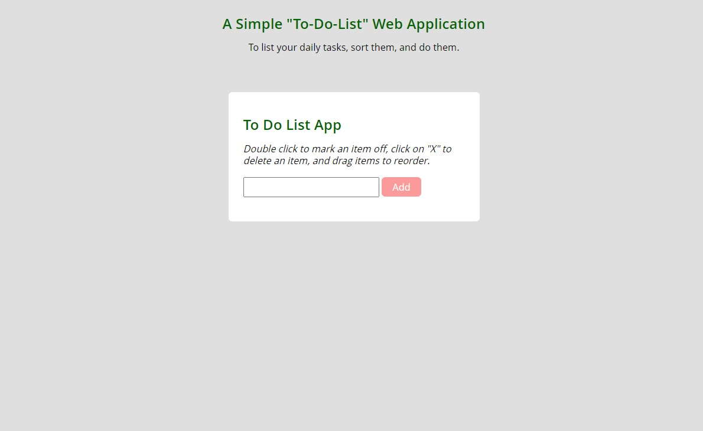
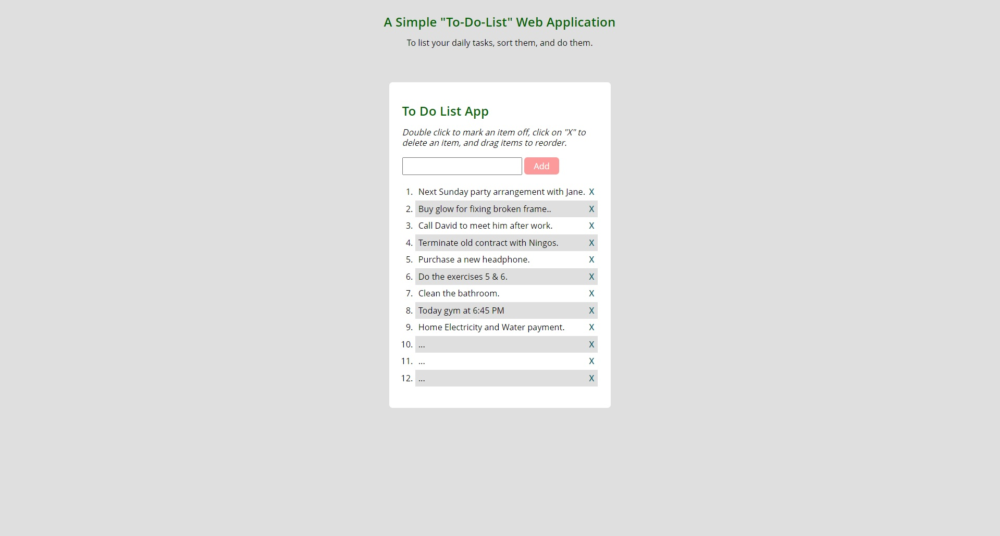
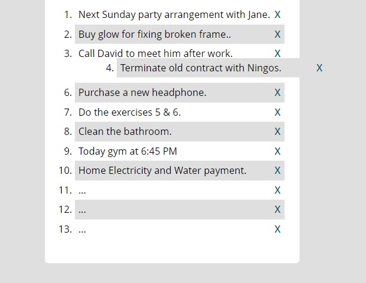

# To-Do-List Web Application:

> In this project users are able to create a list of daily tasks (To-Do-List) by write any task inside the input box and click on "Add" button. Then task will added to the list as an item.

> Users are able to click and drag & drop items inside the list to sort them:

The app gets the input data from the client after any click on the 'Add' button, and then adds any inputs to the list.

Users are able:
- Delete any items in the list by clicking on 'X' sign in the right side of any items.
- Dabble click on any items to make them crossed off the list.
- Click and hold any items to drag and drop them to move inside the list.  

## Built With

- Major languages: HTML - CSS - Java Script.
- Technologies used: jQuery.

## Live Demo

[To-Do-List Live Demo Link](https://siavash-ebrahimi.github.io/To-Do-List-app/)
